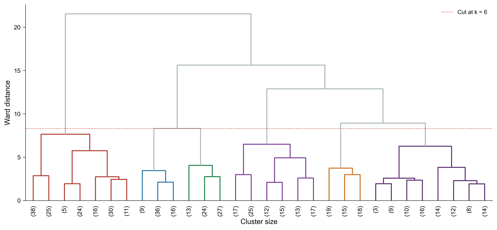
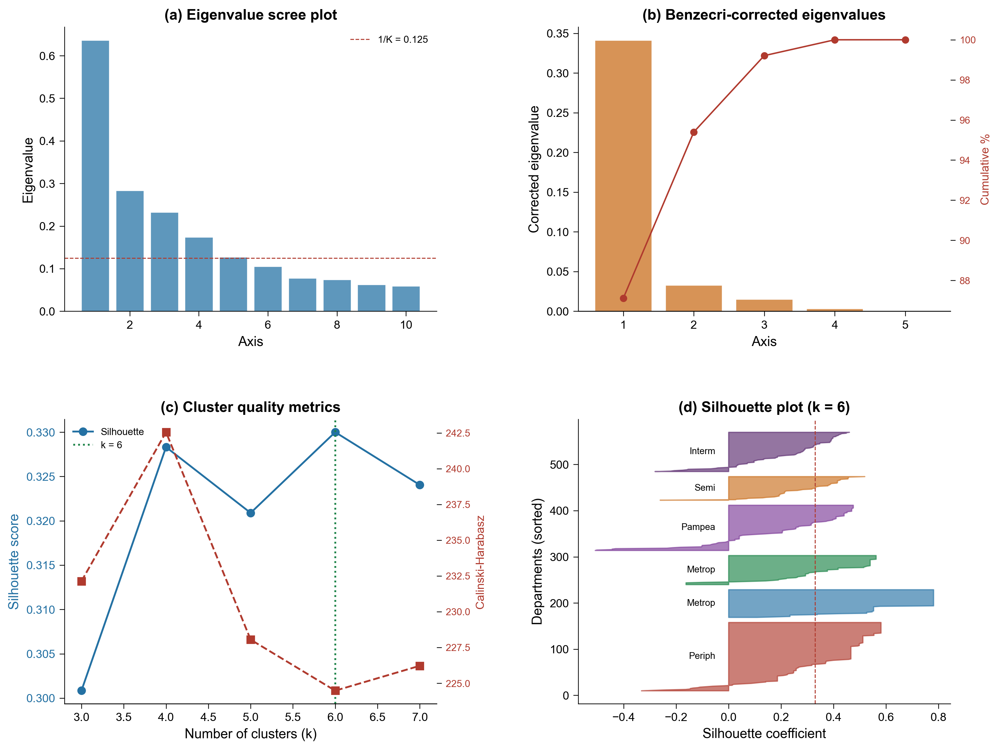

# Supplementary Material

## The Spatiality of Software: Subnational Economic Complexity from GitHub Data in Argentina

**Author:** Raimundo Elias Gomez

---

### Figure S1. Ward's Dendrogram

*Ward's dendrogram on five MCA factorial coordinates (N = 511). The red line indicates the six-type solution selected on the basis of silhouette and Calinski-Harabasz indices (Table 1, Panel B). The hierarchical structure shows the first split separating Peripheral-Deprived departments from the rest, followed by the metropolitan-educated complex splitting from intermediate types.*

### Figure S2. MCA and Clustering Diagnostics

*Diagnostic panel. (a) Raw MCA eigenvalues; (b) Benzecri-corrected eigenvalues with retention threshold; (c) Silhouette and Calinski-Harabasz indices for k = 3-7; (d) Per-sample silhouette scores for the six-type solution.*

---

### Table S1. Full ECI Ranking

Complete ranking of 224 departments by ECI_software, with cluster assignment and sociodemographic variables.

**File:** `table_S1_eci_full_ranking.csv`

| Column | Description |
|--------|-------------|
| dpto5 | INDEC department code |
| departamento | Department name |
| provincia | Province |
| region | Region (CABA, Pampeana, NOA, NEA, Cuyo, Patagonia) |
| mca_cluster_label | MCA-CAH cluster assignment |
| eci_software | Economic Complexity Index (standardised) |
| eci_diversity | Number of languages with RCA >= 1 |
| eci_avg_ubiquity | Mean ubiquity of RCA languages |
| gh_total_developers | Total geocoded developers |
| gh_total_repos | Total repositories |
| gh_devs_per_10k | Developers per 10,000 inhabitants |
| pob_2010, pob_2022 | Population (census) |
| pct_jefe_sec_2010 | % household heads with secondary education |
| pct_pc_2010 | % households with computer |
| pct_nbi_2010 | % with unsatisfied basic needs |
| rad_2014 | Mean nighttime radiance |

### Table S2. Cluster x Region Cross-Tabulation

Cross-tabulation of six departmental types with six Argentine regions (chi-squared = 351.5, df = 25, *p* < 0.001, Cramer's *V* = 0.371).

**File:** `table_S2_cluster_region_crosstab.csv`

### Table S3. Small-Type Departments

Individual-level data for departments in Peripheral-Deprived (N = 13 with ECI) and Semi-Rural-Active (N = 5 with ECI), where multivariate regression is not feasible due to small sample size. Bivariate correlations with bootstrap confidence intervals are reported in the article text.

**File:** `table_S3_small_types_data.csv`

### Table S4. Within-Type Correlations with ECIsoftware

Pearson correlations between ECIsoftware and 16 candidate variables, computed separately for each departmental type (MCA-CAH classification). Variables were selected from the full set of ~208 available indicators on the basis of theoretical relevance across five domains: cultural capital, demography, infrastructure, digital access, and spatial inequality. Only the *N* departments with non-missing ECI values within each type enter the within-type correlations. Correlations for Semi-Rural-Active (*N* = 5) are reported for completeness but should not be interpreted given the minimal sample size. Correlations with |*r*| > 0.30 within at least one type are highlighted in the article text (§4.3.4).

**File:** `table_S4_within_type_correlations.csv`

| Column | Description |
|--------|-------------|
| variable | Variable name in art1.departamentos |
| domain | Thematic domain |
| national_r / national_n | Pearson *r* with ECI and *N* for the full sample |
| [type]_r / [type]_n | Pearson *r* with ECI and *N* within each departmental type |
